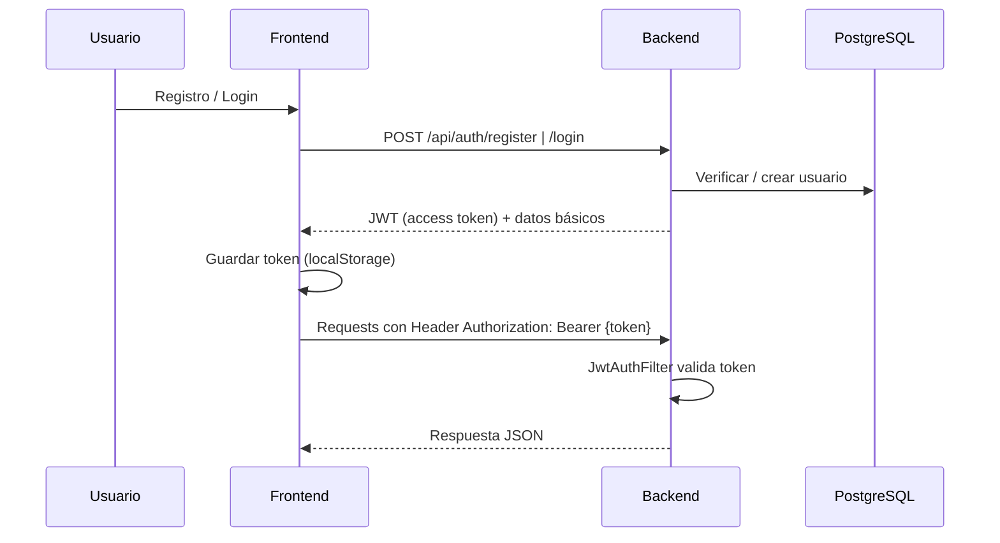
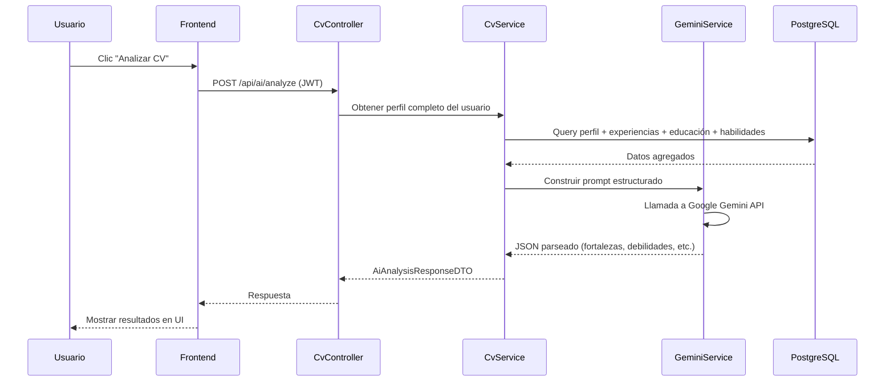
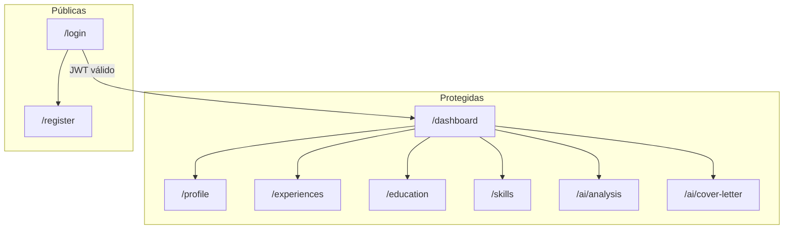

# SmartCV IA — Arquitectura del Sistema

> Documento de diseño previo a la implementación.  
> Proyecto universitario — TP Integrador: Desarrollo Ágil Asistido por IA.

---

## 1. Visión General

**SmartCV IA** es una plataforma web full-stack que permite a los usuarios registrarse, construir su perfil profesional (CV digital) y obtener asistencia de inteligencia artificial para mejorar su empleabilidad.

### Objetivos del sistema

| Objetivo | Descripción |
|----------|-------------|
| Gestión de CV | CRUD completo de perfil, experiencia, educación y habilidades |
| Análisis inteligente | La IA evalúa el CV y devuelve fortalezas, debilidades y recomendaciones |
| Generación de contenido | La IA produce cartas de presentación personalizadas |
| Seguridad | Autenticación JWT, roles USER/ADMIN, endpoints protegidos |
| Despliegue | Frontend (Vercel), Backend (Render), DB (Neon) |

### Principios de diseño

- **Separación de capas**: Controller → Service → Repository (backend); Pages → Hooks/Services → API (frontend).
- **DTOs y mappers**: Nunca exponer entidades JPA directamente en la API.
- **Desacoplamiento de IA**: El servicio de Gemini vive en una capa aislada; si cambia el proveedor, solo se modifica esa capa.
- **Seguridad por defecto**: Todos los endpoints de negocio requieren JWT salvo `/auth/**`.
- **Validación en dos frentes**: Bean Validation (backend) + validación de formularios (frontend).

---

## 2. Arquitectura de Alto Nivel

```
┌─────────────────────────────────────────────────────────────────────────────┐
│                              USUARIO (Browser)                              │
└──────────────────────────────────┬──────────────────────────────────────────┘
                                   │ HTTPS
                                   ▼
┌─────────────────────────────────────────────────────────────────────────────┐
│                         FRONTEND — React + Vite (Vercel)                    │
│  ┌──────────┐  ┌────────────┐  ┌──────────┐  ┌─────────────────────────┐  │
│  │  Pages   │  │ Components │  │  Hooks   │  │  Services (Axios + JWT)  │  │
│  └────┬─────┘  └─────┬──────┘  └────┬─────┘  └────────────┬────────────┘  │
│       └──────────────┴──────────────┴─────────────────────┘               │
│                              React Router                                    │
└──────────────────────────────────┬──────────────────────────────────────────┘
                                   │ REST API (JSON)
                                   ▼
┌─────────────────────────────────────────────────────────────────────────────┐
│                    BACKEND — Spring Boot 3 (Render)                         │
│  ┌────────────┐  ┌────────────┐  ┌──────────────┐  ┌─────────────────────┐  │
│  │ Controllers│→ │  Services  │→ │ Repositories │→ │  Spring Data JPA    │  │
│  └────────────┘  └─────┬──────┘  └──────────────┘  └──────────┬──────────┘  │
│                        │                                        │            │
│  ┌────────────┐  ┌─────▼──────┐  ┌──────────────┐             │            │
│  │   DTOs     │  │ Gemini Svc │  │   Mappers    │             │            │
│  └────────────┘  └─────┬──────┘  └──────────────┘             │            │
│                        │                                        │            │
│  ┌────────────────────────────────────────┐                  │            │
│  │ Spring Security + JWT Filter Chain       │                  │            │
│  └────────────────────────────────────────┘                  │            │
└──────────────────────────────┬───────────────────────────────┼────────────┘
                               │                               │
                               ▼                               ▼
                    ┌──────────────────┐            ┌──────────────────┐
                    │ Google Gemini API│            │ PostgreSQL (Neon)│
                    └──────────────────┘            └──────────────────┘
```

### Flujo de autenticación (JWT)



### Flujo de análisis de CV con IA



---

## 3. Modelo Entidad-Relación

### Diagrama ER

```mermaid
erDiagram
    USERS {
        bigint id PK
        varchar email UK "NOT NULL"
        varchar password "NOT NULL, BCrypt"
        enum role "USER | ADMIN"
        timestamp created_at
        timestamp updated_at
    }

    PROFILES {
        bigint id PK
        bigint user_id FK UK "1:1 con USERS"
        varchar first_name
        varchar last_name
        varchar phone
        varchar linkedin_url
        varchar github_url
        text professional_summary
        timestamp created_at
        timestamp updated_at
    }

    WORK_EXPERIENCES {
        bigint id PK
        bigint user_id FK
        varchar company "NOT NULL"
        varchar position "NOT NULL"
        date start_date "NOT NULL"
        date end_date "NULL = actualidad"
        text description
        timestamp created_at
        timestamp updated_at
    }

    EDUCATIONS {
        bigint id PK
        bigint user_id FK
        varchar institution "NOT NULL"
        varchar degree "NOT NULL"
        int start_year "NOT NULL"
        int end_year "NULL = en curso"
        timestamp created_at
        timestamp updated_at
    }

    SKILLS {
        bigint id PK
        bigint user_id FK
        varchar name "NOT NULL"
        enum level "BASICO | INTERMEDIO | AVANZADO | EXPERTO"
        timestamp created_at
        timestamp updated_at
    }

    USERS ||--|| PROFILES : "tiene"
    USERS ||--o{ WORK_EXPERIENCES : "posee"
    USERS ||--o{ EDUCATIONS : "posee"
    USERS ||--o{ SKILLS : "posee"
```

### Descripción de entidades

#### `users`
Tabla central de autenticación. El email es único. La contraseña se almacena hasheada con BCrypt.

| Campo | Tipo | Restricciones |
|-------|------|---------------|
| id | BIGSERIAL | PK |
| email | VARCHAR(255) | UNIQUE, NOT NULL |
| password | VARCHAR(255) | NOT NULL |
| role | VARCHAR(20) | DEFAULT 'USER' |
| created_at | TIMESTAMP | AUTO |
| updated_at | TIMESTAMP | AUTO |

#### `profiles`
Relación **1:1** con `users`. Contiene datos personales/profesionales del CV. El email visible en el perfil se obtiene de `users.email` (no se duplica).

#### `work_experiences`
Relación **1:N** con `users`. `end_date` nullable indica trabajo actual.

#### `educations`
Relación **1:N** con `users`. Años como enteros para simplificar el modelo académico.

#### `skills`
Relación **1:N** con `users`. Nivel tipificado por enum.

### Reglas de negocio en el modelo

1. Un usuario solo puede ver/editar **sus propios** registros (filtro por `user_id` en servicios).
2. ADMIN puede listar todos los usuarios (endpoint administrativo opcional).
3. Al eliminar un usuario, se eliminan en cascada perfil, experiencias, educación y habilidades (`ON DELETE CASCADE`).
4. El análisis de IA **no persiste** resultados en BD en la versión inicial (se genera on-demand). Opcional futuro: tabla `ai_analyses` para historial.

### Índices recomendados

```sql
CREATE UNIQUE INDEX idx_users_email ON users(email);
CREATE UNIQUE INDEX idx_profiles_user_id ON profiles(user_id);
CREATE INDEX idx_work_experiences_user_id ON work_experiences(user_id);
CREATE INDEX idx_educations_user_id ON educations(user_id);
CREATE INDEX idx_skills_user_id ON skills(user_id);
```

---

## 4. Diseño de la API REST

### Convenciones

- Base URL: `/api`
- Formato: JSON
- Autenticación: `Authorization: Bearer <token>`
- Códigos HTTP estándar: 200, 201, 400, 401, 403, 404, 500

### Endpoints

#### Autenticación (públicos)

| Método | Ruta | Descripción |
|--------|------|-------------|
| POST | `/api/auth/register` | Registro de usuario |
| POST | `/api/auth/login` | Login, devuelve JWT |

#### Perfil (protegidos — USER)

| Método | Ruta | Descripción |
|--------|------|-------------|
| GET | `/api/profile` | Obtener perfil del usuario autenticado |
| PUT | `/api/profile` | Crear o actualizar perfil |

#### Experiencia laboral

| Método | Ruta | Descripción |
|--------|------|-------------|
| GET | `/api/experiences` | Listar experiencias del usuario |
| GET | `/api/experiences/{id}` | Obtener una experiencia |
| POST | `/api/experiences` | Crear experiencia |
| PUT | `/api/experiences/{id}` | Actualizar experiencia |
| DELETE | `/api/experiences/{id}` | Eliminar experiencia |

#### Educación

| Método | Ruta | Descripción |
|--------|------|-------------|
| GET | `/api/educations` | Listar estudios |
| GET | `/api/educations/{id}` | Obtener un estudio |
| POST | `/api/educations` | Crear estudio |
| PUT | `/api/educations/{id}` | Actualizar estudio |
| DELETE | `/api/educations/{id}` | Eliminar estudio |

#### Habilidades

| Método | Ruta | Descripción |
|--------|------|-------------|
| GET | `/api/skills` | Listar habilidades |
| GET | `/api/skills/{id}` | Obtener una habilidad |
| POST | `/api/skills` | Crear habilidad |
| PUT | `/api/skills/{id}` | Actualizar habilidad |
| DELETE | `/api/skills/{id}` | Eliminar habilidad |

#### Dashboard

| Método | Ruta | Descripción |
|--------|------|-------------|
| GET | `/api/dashboard/stats` | Contadores de experiencias, estudios y habilidades |

#### Inteligencia Artificial

| Método | Ruta | Descripción |
|--------|------|-------------|
| POST | `/api/ai/analyze` | Analizar CV completo |
| POST | `/api/ai/cover-letter` | Generar carta de presentación |

#### Administración (protegidos — ADMIN)

| Método | Ruta | Descripción |
|--------|------|-------------|
| GET | `/api/admin/users` | Listar todos los usuarios |

### DTOs principales (backend)

```
auth/
  RegisterRequestDTO      → email, password
  LoginRequestDTO         → email, password
  AuthResponseDTO         → token, email, role

profile/
  ProfileRequestDTO       → firstName, lastName, phone, linkedin, github, summary
  ProfileResponseDTO      → id, firstName, lastName, email, phone, linkedin, github, summary

experience/
  WorkExperienceRequestDTO
  WorkExperienceResponseDTO

education/
  EducationRequestDTO
  EducationResponseDTO

skill/
  SkillRequestDTO
  SkillResponseDTO

dashboard/
  DashboardStatsDTO       → experienceCount, educationCount, skillCount

ai/
  AiAnalysisResponseDTO   → strengths[], weaknesses[], recommendations[], suggestedSkills[]
  CoverLetterRequestDTO   → targetPosition?, targetCompany? (opcionales)
  CoverLetterResponseDTO  → content
```

---

## 5. Seguridad

### Configuración Spring Security

```
Rutas públicas:
  POST /api/auth/**
  GET  /actuator/health (opcional, para Render)

Rutas USER:
  /api/profile/**
  /api/experiences/**
  /api/educations/**
  /api/skills/**
  /api/dashboard/**
  /api/ai/**

Rutas ADMIN:
  /api/admin/**
```

### Componentes de seguridad

| Componente | Responsabilidad |
|------------|-----------------|
| `JwtTokenProvider` | Generar y validar tokens JWT |
| `JwtAuthenticationFilter` | Interceptar requests y extraer token |
| `CustomUserDetailsService` | Cargar usuario desde BD |
| `SecurityConfig` | Configurar filter chain, CORS, BCrypt |
| `PasswordEncoder` | BCrypt para hash de contraseñas |

### CORS

Orígenes permitidos:
- `http://localhost:5173` (desarrollo)
- URL de producción en Vercel (variable de entorno)

---

## 6. Capa de Inteligencia Artificial

### Servicio: `GeminiService`

Responsabilidades aisladas:
1. Construir prompts estructurados a partir del DTO agregado del CV.
2. Invocar la API de Google Gemini (`gemini-1.5-flash` o `gemini-2.0-flash`).
3. Parsear la respuesta JSON y mapear a DTOs.

### Prompt — Analizar CV (borrador)

```
Eres un experto en recursos humanos y empleabilidad.
Analiza el siguiente perfil profesional y responde ÚNICAMENTE en JSON válido con esta estructura:
{
  "strengths": ["..."],
  "weaknesses": ["..."],
  "recommendations": ["..."],
  "suggestedSkills": ["..."]
}

Perfil:
{datos serializados del usuario}
```

### Prompt — Carta de presentación (borrador)

```
Eres un redactor profesional de cartas de presentación.
Genera una carta de presentación en español, profesional y persuasiva,
basada en el siguiente perfil. Máximo 400 palabras.

Perfil:
{datos serializados}

Puesto objetivo: {targetPosition}
Empresa objetivo: {targetCompany}
```

### Variables de entorno

```
GEMINI_API_KEY=...
GEMINI_MODEL=gemini-1.5-flash
```

---

## 7. Manejo de Errores

### `GlobalExceptionHandler`

| Excepción | HTTP | Respuesta |
|-----------|------|-----------|
| `MethodArgumentNotValidException` | 400 | Lista de errores de validación |
| `ResourceNotFoundException` | 404 | Mensaje descriptivo |
| `AccessDeniedException` | 403 | Acceso denegado |
| `BadCredentialsException` | 401 | Credenciales inválidas |
| `EmailAlreadyExistsException` | 409 | Email ya registrado |
| `GeminiApiException` | 502 | Error al comunicarse con IA |
| `Exception` (genérica) | 500 | Error interno (sin detalles sensibles) |

### Formato de error estándar

```json
{
  "timestamp": "2026-06-13T10:00:00",
  "status": 400,
  "error": "Validation Failed",
  "message": "El email es obligatorio",
  "path": "/api/auth/register"
}
```

---

## 8. Infraestructura y Despliegue

### Entornos

| Entorno | Frontend | Backend | Base de datos |
|---------|----------|---------|---------------|
| Local | Vite dev (:5173) | Spring Boot (:8080) | PostgreSQL Docker (:5432) |
| Producción | Vercel | Render | Neon (PostgreSQL serverless) |

### Docker Compose (desarrollo local)

```
Servicios:
  - postgres:15-alpine  → puerto 5432
  - backend             → puerto 8080, depende de postgres
  - frontend            → puerto 80 (nginx), depende de backend
```

### GitHub Actions (CI)

```
Pipeline:
  1. Checkout
  2. Backend: mvn test + mvn package
  3. Frontend: npm ci + npm run build + npm test (si aplica)
  4. (Opcional) Deploy automático a Vercel/Render
```

### Variables de entorno por servicio

**Backend (Render)**
```
DATABASE_URL=jdbc:postgresql://...
DB_USERNAME=
DB_PASSWORD=
JWT_SECRET=
JWT_EXPIRATION=86400000
GEMINI_API_KEY=
CORS_ALLOWED_ORIGINS=https://smartcv.vercel.app
```

**Frontend (Vercel)**
```
VITE_API_BASE_URL=https://smartcv-api.onrender.com/api
```

---

## 9. Estructura de Carpetas

### Monorepo

```
smartcv/
├── .github/
│   └── workflows/
│       └── ci.yml
├── backend/
│   ├── Dockerfile
│   ├── pom.xml
│   └── src/
│       ├── main/
│       │   ├── java/com/smartcv/
│       │   │   ├── SmartCvApplication.java
│       │   │   ├── config/
│       │   │   │   ├── SecurityConfig.java
│       │   │   │   ├── CorsConfig.java
│       │   │   │   └── OpenApiConfig.java
│       │   │   ├── controller/
│       │   │   │   ├── AuthController.java
│       │   │   │   ├── ProfileController.java
│       │   │   │   ├── WorkExperienceController.java
│       │   │   │   ├── EducationController.java
│       │   │   │   ├── SkillController.java
│       │   │   │   ├── DashboardController.java
│       │   │   │   ├── AiController.java
│       │   │   │   └── AdminController.java
│       │   │   ├── dto/
│       │   │   │   ├── auth/
│       │   │   │   ├── profile/
│       │   │   │   ├── experience/
│       │   │   │   ├── education/
│       │   │   │   ├── skill/
│       │   │   │   ├── dashboard/
│       │   │   │   ├── ai/
│       │   │   │   └── common/
│       │   │   │       └── ErrorResponseDTO.java
│       │   │   ├── entity/
│       │   │   │   ├── User.java
│       │   │   │   ├── Profile.java
│       │   │   │   ├── WorkExperience.java
│       │   │   │   ├── Education.java
│       │   │   │   ├── Skill.java
│       │   │   │   └── enums/
│       │   │   │       ├── Role.java
│       │   │   │       └── SkillLevel.java
│       │   │   ├── exception/
│       │   │   │   ├── GlobalExceptionHandler.java
│       │   │   │   ├── ResourceNotFoundException.java
│       │   │   │   ├── EmailAlreadyExistsException.java
│       │   │   │   └── GeminiApiException.java
│       │   │   ├── mapper/
│       │   │   │   ├── UserMapper.java
│       │   │   │   ├── ProfileMapper.java
│       │   │   │   ├── WorkExperienceMapper.java
│       │   │   │   ├── EducationMapper.java
│       │   │   │   └── SkillMapper.java
│       │   │   ├── repository/
│       │   │   │   ├── UserRepository.java
│       │   │   │   ├── ProfileRepository.java
│       │   │   │   ├── WorkExperienceRepository.java
│       │   │   │   ├── EducationRepository.java
│       │   │   │   └── SkillRepository.java
│       │   │   ├── security/
│       │   │   │   ├── JwtTokenProvider.java
│       │   │   │   ├── JwtAuthenticationFilter.java
│       │   │   │   └── CustomUserDetailsService.java
│       │   │   └── service/
│       │   │       ├── AuthService.java
│       │   │       ├── ProfileService.java
│       │   │       ├── WorkExperienceService.java
│       │   │       ├── EducationService.java
│       │   │       ├── SkillService.java
│       │   │       ├── DashboardService.java
│       │   │       ├── AiService.java
│       │   │       └── GeminiService.java
│       │   └── resources/
│       │       ├── application.yml
│       │       ├── application-dev.yml
│       │       └── application-prod.yml
│       └── test/
│           └── java/com/smartcv/
│               ├── controller/
│               ├── service/
│               └── SmartCvApplicationTests.java
├── frontend/
│   ├── Dockerfile
│   ├── nginx.conf
│   ├── package.json
│   ├── vite.config.js
│   ├── index.html
│   └── src/
│       ├── main.jsx
│       ├── App.jsx
│       ├── routes/
│       │   ├── AppRoutes.jsx
│       │   └── ProtectedRoute.jsx
│       ├── pages/
│       │   ├── LoginPage.jsx
│       │   ├── RegisterPage.jsx
│       │   ├── DashboardPage.jsx
│       │   ├── ProfilePage.jsx
│       │   ├── ExperiencesPage.jsx
│       │   ├── EducationPage.jsx
│       │   ├── SkillsPage.jsx
│       │   ├── AiAnalysisPage.jsx
│       │   └── CoverLetterPage.jsx
│       ├── components/
│       │   ├── layout/
│       │   │   ├── AppLayout.jsx
│       │   │   ├── Navbar.jsx
│       │   │   └── Sidebar.jsx
│       │   ├── auth/
│       │   │   ├── LoginForm.jsx
│       │   │   └── RegisterForm.jsx
│       │   ├── profile/
│       │   │   └── ProfileForm.jsx
│       │   ├── experience/
│       │   │   ├── ExperienceList.jsx
│       │   │   └── ExperienceForm.jsx
│       │   ├── education/
│       │   │   ├── EducationList.jsx
│       │   │   └── EducationForm.jsx
│       │   ├── skills/
│       │   │   ├── SkillList.jsx
│       │   │   └── SkillForm.jsx
│       │   ├── dashboard/
│       │   │   └── StatsCards.jsx
│       │   ├── ai/
│       │   │   ├── AnalysisResult.jsx
│       │   │   └── CoverLetterResult.jsx
│       │   └── common/
│       │       ├── LoadingSpinner.jsx
│       │       ├── ErrorAlert.jsx
│       │       └── ConfirmDialog.jsx
│       ├── hooks/
│       │   ├── useAuth.js
│       │   ├── useProfile.js
│       │   ├── useExperiences.js
│       │   ├── useEducations.js
│       │   ├── useSkills.js
│       │   └── useAi.js
│       ├── services/
│       │   ├── api.js              # Instancia Axios + interceptors JWT
│       │   ├── authService.js
│       │   ├── profileService.js
│       │   ├── experienceService.js
│       │   ├── educationService.js
│       │   ├── skillService.js
│       │   ├── dashboardService.js
│       │   └── aiService.js
│       ├── context/
│       │   └── AuthContext.jsx
│       └── theme/
│           └── theme.js            # Material UI theme
├── docker-compose.yml
├── .env.example
├── .gitignore
├── README.md
└── docs/
    ├── ARQUITECTURA.md             # Este documento
    └── INFORME-TECNICO.md          # Bitácora de IA (post-desarrollo)
```

---

## 10. Mapa de Pantallas (Frontend)



| Ruta | Página | Descripción |
|------|--------|-------------|
| `/login` | LoginPage | Formulario de acceso |
| `/register` | RegisterPage | Registro de cuenta |
| `/dashboard` | DashboardPage | Tarjetas con estadísticas |
| `/profile` | ProfilePage | Edición de datos personales |
| `/experiences` | ExperiencesPage | CRUD de experiencia laboral |
| `/education` | EducationPage | CRUD de educación |
| `/skills` | SkillsPage | CRUD de habilidades |
| `/ai/analysis` | AiAnalysisPage | Resultado del análisis IA |
| `/ai/cover-letter` | CoverLetterPage | Generador de carta |

---

## 11. Plan de Implementación (fases)

| Fase | Contenido | Entregable |
|------|-----------|------------|
| **0** | Arquitectura y diseño | Este documento |
| **1** | Backend base: entidades, repos, auth JWT | API de autenticación funcional |
| **2** | CRUDs: perfil, experiencia, educación, habilidades | API completa de CV |
| **3** | Dashboard + validaciones + excepciones globales | API robusta |
| **4** | Integración Gemini (análisis + carta) | Endpoints de IA |
| **5** | Frontend: auth, layout, rutas protegidas | Shell de la app |
| **6** | Frontend: páginas CRUD + dashboard | UI funcional |
| **7** | Frontend: páginas IA | Flujo completo end-to-end |
| **8** | Docker + docker-compose | Entorno local containerizado |
| **9** | GitHub Actions CI | Pipeline automático |
| **10** | Deploy Vercel + Render + Neon | Demo online |
| **11** | README + Informe Técnico | Documentación de entrega |

---

## 12. Decisiones Técnicas Clave

| Decisión | Elección | Justificación |
|----------|----------|---------------|
| Monorepo | `backend/` + `frontend/` | Facilita CI/CD y Docker Compose |
| ID en entidades hijas | `user_id` directo (no solo vía profile) | Simplifica queries y autorización |
| IA sin persistencia | Respuesta on-demand | Reduce complejidad; historial es mejora futura |
| Mappers manuales | Clases `@Component` | Sin dependencia extra; suficiente para el alcance |
| Token storage | localStorage | Simple para proyecto universitario |
| Material UI | Tema personalizado SmartCV | UI profesional con poco esfuerzo |
| PostgreSQL en Neon | Serverless free tier | Compatible con Render, sin gestionar servidor |

---

*Documento generado como Fase 0 del proyecto SmartCV IA.*
